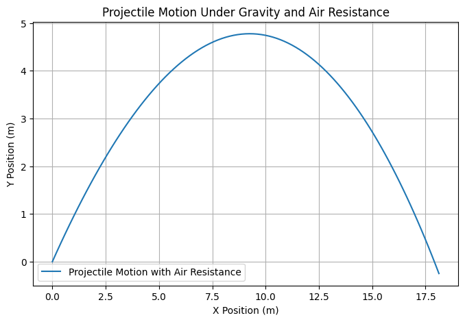

## Investigating the Range as a Function of the Angle of Projection

## **Step 1: Establish the Theoretical Foundation**
# **Projectile Motion with Air Resistance**  

## **1. Equations of Motion**  
- The equations governing projectile motion with air resistance are derived from Newton’s second law. We consider a projectile of mass $m$ moving under the influence of gravity and an opposing air resistance force proportional to velocity.  

The equations of motion are given by:  

$$
m \cdot x'' = -b \cdot x'
$$

$$
m \cdot y'' = -mg - b \cdot y'
$$

### **Where:**
- $m$ = mass of the projectile (kg)  
- $g$ = gravitational acceleration (9.81 m/s²)  
- $b$ = air resistance coefficient (kg/s)  
- $x', y'$ = velocity components  

---

## **2. Initial Conditions**  
The initial conditions define the starting point and initial velocity components of the projectile.  

$$
x_0 = 0, \quad y_0 = 0
$$

(Starting position at the origin)  

$$
v_{x0} = 10, \quad v_{y0} = 10
$$

(Initial velocity components in m/s)  

---

## **3. Deriving the Equations of Motion**  

### **Step 1: Solve for Horizontal Motion**  
From the equation:

$$
m \cdot x'' = -b \cdot x'
$$

Rewriting:

$$
x'' + \frac{b}{m} x' = 0
$$

This is a first-order linear differential equation in $x'$. The general solution for velocity is:

$$
x'(t) = v_{x0} e^{-\frac{b}{m} t}
$$

To find the horizontal displacement, integrate:

$$
x(t) = \frac{m}{b} v_{x0} \left( 1 - e^{-\frac{b}{m} t} \right)
$$

---

### **Step 2: Solve for Vertical Motion**  
From the vertical motion equation:

$$
m \cdot y'' = -mg - b \cdot y'
$$

Rewriting:

$$
y'' + \frac{b}{m} y' + g = 0
$$

Solving for $y'$:

$$
y'(t) = \left( v_{y0} + \frac{mg}{b} \right) e^{-\frac{b}{m} t} - \frac{mg}{b}
$$

Integrating to get $y(t)$:

$$
y(t) = \frac{m}{b} \left( v_{y0} + \frac{mg}{b} \right) \left( 1 - e^{-\frac{b}{m} t} \right) - \frac{mg}{b} t
$$

For small air resistance ($b \approx 0$), this simplifies to:

$$
y(t) = v_0 \sin \theta \cdot t - \frac{1}{2} g t^2
$$

---

## **4. Calculate the Time of Flight**  
The projectile reaches the ground when $y = 0$. Using the simplified equation:

$$
y(t) = v_0 \sin \theta \cdot t - \frac{1}{2} g t^2
$$

Setting $y = 0$ and solving for $t$:

$$
t \left( v_0 \sin \theta - \frac{1}{2} g t \right) = 0
$$

This gives two solutions:

$$
t = 0 \quad \text{(initial time)}
$$

$$
t = \frac{2 v_0 \sin \theta}{g}
$$

Thus, the total time of flight is:

$$
T = \frac{2 v_0 \sin \theta}{g}
$$


#### **4. Derive the Range Equation**
- The range is the horizontal distance at $T$:

  $$ R = v_0 \cos\theta \cdot T$$

- Substituting $T$:

  $$
  R = v_0 \cos \theta \cdot \frac{2 v_0 \sin \theta}{g}
  $$

- Using the trigonometric identity $2 \sin \theta \cos \theta = \sin 2\theta$ , we obtain:

  $$
  R = \frac{v_0^2 \sin 2\theta}{g}
  $$

#### **5. Find the Optimal Angle for Maximum Range**
- The range depends on $\sin 2\theta$, which is maximized when $2\theta = 90^\circ$, or $\theta = 45^\circ$.
- Thus, the optimal angle for maximum range is $45^\circ$.

### **Step 3: Analyze How Range Changes with Angle**

#### **1. Varying the Angle from 0° to 90°**
- Compute $R$ for multiple angles and observe how it changes.

#### **2. Effects of Initial Velocity**
- Increase or decrease $v_0$ and check how it impacts $ R $.

#### **3. Effects of Gravity**
- Consider different values of $g$ (e.g., Earth vs. Moon) and see how the range varies.

#### **4. Find the Symmetry**
- The equation $R = \frac{v_0^2}{g} \sin 2\theta$ is **symmetric**, meaning:
  - $\theta = 30^\circ $ and $ \theta = 60^\circ$ give the same range.
  - $\theta = 20^\circ $ and $ \theta = 70^\circ$ also give the same range.

---

### **Step 4: Practical Applications**

#### **1. Sports Applications**
- Optimizing kick angles in soccer, golf, or basketball for maximum range.

#### **2. Ballistics & Military Applications**
- Determining the best firing angle for artillery.

#### **3. Rocket Science**
- Understanding launch angles for spacecraft trajectories.

---

### **Step 5: Implementation in Python**

```python
import numpy as np
import matplotlib.pyplot as plt
from scipy.integrate import solve_ivp

# Parameters
m = 1.0   # Mass (kg)
g = 9.81  # Gravity (m/s^2)
b = 0.1   # Air resistance coefficient (kg/s)

# Initial conditions
x0, y0 = 0.0, 0.0  # Initial position (m)
vx0, vy0 = 10.0, 10.0  # Initial velocity (m/s)

# Define the equations of motion with air resistance
def equations(t, state):
    x, vx, y, vy = state
    dxdt = vx
    dvxdt = - (b / m) * vx  # Air resistance in x-direction
    dydt = vy
    dvydt = -g - (b / m) * vy  # Gravity and air resistance in y-direction
    return [dxdt, dvxdt, dydt, dvydt]

# Time span for simulation
t_span = (0, 2)
t_eval = np.linspace(0, 2, 100)

# Solve the system
sol = solve_ivp(equations, t_span, [x0, vx0, y0, vy0], t_eval=t_eval)

# Extract solution
x, vx, y, vy = sol.y

# Plot results
plt.figure(figsize=(8, 5))
plt.plot(x, y, label="Projectile Motion with Air Resistance")
plt.xlabel("X Position (m)")
plt.ylabel("Y Position (m)")
plt.title("Projectile Motion Under Gravity and Air Resistance")
plt.legend()
plt.grid()
plt.show()
```
---

---

### **Step 6: Discussion & Limitations**

#### **1. What does the graph show?**
- A clear peak at $ \theta = 45^\circ $.
- Symmetry in range for complementary angles.

#### **2. Limitations of the Model**
- Assumes flat ground .

#### **3. How to Improve the Model?**
- Add drag force.
- Consider different launch heights.