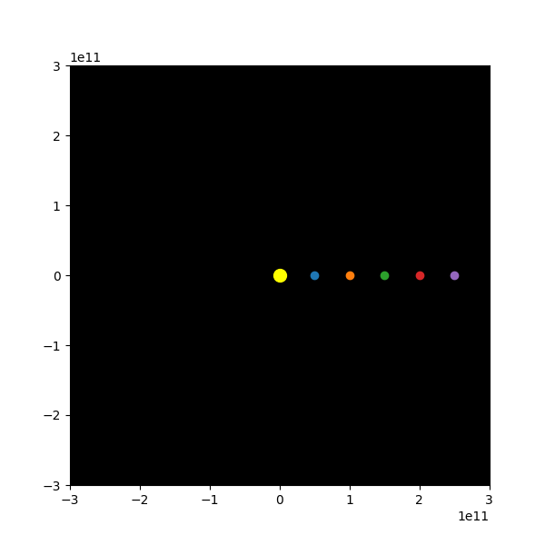
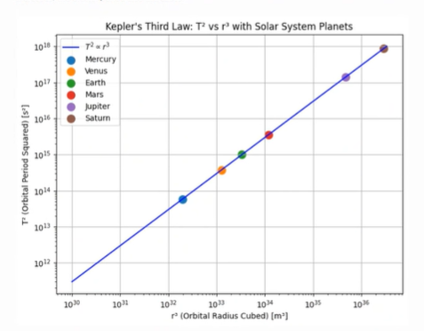

# Problem 1

## 1. Deriving the Relationship Between Orbital Period and Orbital Radius for Circular Orbits

### Starting with Newton’s Law of Gravitation

The first step in deriving the relationship is to apply **Newton's law of gravitation**, which tells us that the force $F$ between two masses $m_1$ and $m_2$ is inversely proportional to the square of the distance $r$ between them:

$$
F = \frac{G m_1 m_2}{r^2}
$$

Where:
- $G$ is the **gravitational constant**, which has a value of:
  
  $$
  G = 6.67430 \times 10^{-11} \, \text{m}^3 \, \text{kg}^{-1} \, \text{s}^{-2}
  $$

- $m_1$ is the mass of the **central object** (e.g., the Sun or Earth).
- $m_2$ is the mass of the **orbiting object** (e.g., a planet or moon).
- $r$ is the **orbital radius**, which is the distance between the two objects.

### Centripetal Force

In a circular orbit, the gravitational force $F$ that pulls the satellite or planet toward the central body is balanced by the **centripetal force** required to keep the object in orbit. The centripetal force is given by:

$$
F = \frac{m_2 v^2}{r}
$$

Where:
- $v$ is the **orbital speed** (the velocity at which the orbiting object is moving around the central body).

### Equating Gravitational Force and Centripetal Force

Now, equate the two expressions for force:

$$
\frac{G m_1 m_2}{r^2} = \frac{m_2 v^2}{r}
$$

Cancel the mass of the orbiting object $m_2$ from both sides of the equation:

$$
\frac{G m_1}{r^2} = \frac{v^2}{r}
$$

Now, solve for the orbital velocity $v$:

$$
v = \sqrt{\frac{G m_1}{r}}
$$

This expression shows the **orbital speed** of the object based on the mass of the central object $m_1$ and the orbital radius $r$.

### Relating Orbital Period and Orbital Speed

The **orbital period** $T$ is the time it takes for the object to complete one full revolution. The orbital period is related to the orbital speed by the formula:

$$
T = \frac{2 \pi r}{v}
$$

Substitute the expression for $v$ into this equation:

$$
T = \frac{2 \pi r}{\sqrt{\frac{G m_1}{r}}}
$$

Simplifying:

$$
T = 2 \pi \sqrt{\frac{r^3}{G m_1}}
$$

This equation is **Kepler's Third Law**, which states that the **orbital period squared $T^2$** is proportional to the **orbital radius cubed $r^3$**:

$$
T^2 \propto r^3
$$

Where:
- $T^2$ is the square of the orbital period.
- $r^3$ is the cube of the orbital radius.

---

## 2. Discussion of Kepler’s Third Law in Astronomy

### **Calculating Planetary Masses**

By rearranging the equation $T^2 = \frac{4 \pi^2 r^3}{G m_1}$, we can solve for $m_1$, the mass of the central body (such as the Sun or Earth). Given the orbital period $T$ and orbital radius $r$, we can calculate the mass of the central body. This is useful for determining the mass of distant stars or confirming the mass of the Sun.

### **Determining Distances in the Solar System**

Using Kepler's Third Law, if we know the orbital period of a planet or satellite, we can calculate its average orbital distance (orbital radius) from the central body. For example, we can predict the orbital radius of a planet, given its orbital period, or vice versa.

### **Validation of Gravitational Theories**

Kepler's Third Law provides a framework to test the consistency of gravitational theories. By comparing observed orbital periods and radii, we can validate or refine our understanding of gravitational forces.

---

## 3. Real-World Examples

Let’s analyze some real-world examples to understand how Kepler’s Law applies:

### **Moon’s Orbit Around Earth:**

- Orbital radius $r$ ≈ 384,400 km (distance from Earth to the Moon).
- Orbital period $T$ ≈ 27.3 days (time it takes for the Moon to complete one orbit around Earth).

### **Earth’s Orbit Around the Sun:**

- Orbital radius $r$ ≈ 149.6 million km (distance from Earth to the Sun).
- Orbital period $T$ ≈ 365.25 days (time it takes for Earth to complete one orbit around the Sun).

Both of these orbits should follow Kepler’s Third Law.

---

## 4. Implementing a Computational Model

Let’s simulate circular orbits and verify the relationship $T^2 \propto r^3$ using Python.

### **Python Script Explanation**

Below is a Python script to simulate the relationship:

```python
import numpy as np
import matplotlib.pyplot as plt
import matplotlib.animation as animation

# Constants for the central star (like the Sun)
G = 6.67430e-11  # Gravitational constant (m^3 kg^-1 s^-2)
M = 1.989e30     # Mass of the Sun (kg)

# Orbital radii (scaled for visualization)
radii = np.array([0.5, 1.0, 1.5, 2.0, 2.5]) * 1e11  # In meters

# Orbital periods calculated using Kepler's Third Law
periods = np.sqrt((4 * np.pi**2 * radii**3) / (G * M))  # Periods in seconds
periods_days = periods / (60 * 60 * 24)  # Convert to days

# Set up the figure and axis
fig, ax = plt.subplots(figsize=(6, 6))
ax.set_xlim(-3e11, 3e11)
ax.set_ylim(-3e11, 3e11)
ax.set_aspect('equal')
ax.set_facecolor('black')

# Create planets as points that will orbit the central star
planet_points = [plt.plot([], [], 'o', color=f'C{i}', markersize=6)[0] for i in range(len(radii))]

# Define the central star (the Sun)
ax.scatter(0, 0, color='yellow', s=100, label='Sun')

# Function to update planet positions
def update_orbits(frame):
    # Update positions of planets
    for i, planet in enumerate(planet_points):
        angle = 2 * np.pi * frame / periods_days[i]  # Orbital angle based on the time step
        x = radii[i] * np.cos(angle)
        y = radii[i] * np.sin(angle)
        planet.set_data([x], [y])  # Ensure x and y are lists/arrays

    return planet_points

# Create the animation
ani = animation.FuncAnimation(fig, update_orbits, frames=np.arange(0, 365), interval=50, blit=False)

# Save the animation as a GIF
ani.save("kepler_orbit_simulation.gif", writer="pillow")

# Show the plot
plt.show()

```



### Visual Output of the Animation

The animation produced by the code visually represents **Kepler's Third Law** and how the **orbital period squared (T²)** relates to the **orbital radius (r³)**. The animation evolves over time, gradually adding data points to the graph.

#### **Key Features of the Animation:**

1. **X-Axis (Orbital Radius, r)**:
   - The x-axis represents the **orbital radius (r)**, which ranges from **1,000 km (1e6 meters)** to **100,000 km (1e8 meters)**.
   - The x-axis is dynamically scaled to fit the range of orbital radii used in the simulation.

2. **Y-Axis (Orbital Period Squared, T²)**:
   - The y-axis represents the **orbital period squared (T²)** in seconds squared.
   - As per Kepler's Third Law, the y-axis will display values proportional to the cube of the orbital radius.

3. **Red Dashed Line (Theoretical Relationship)**:
   - The **red dashed line** represents the **theoretical relationship** between **T²** and **r³** as predicted by **Kepler's Third Law**.
   - This theoretical curve is computed directly from Kepler’s formula:
     $$
     T^2 = \frac{r^3 (2\pi)^2}{G M}
     $$
   - The red dashed line remains static throughout the animation, providing a reference.

4. **Animated Line (Simulated Relationship)**:
   - The **animated line** gradually builds up as the orbital radius increases, with the orbital period squared (T²) being calculated for each radius.
   - At each frame, a new point is added to the line, progressively showing how **T²** and **r³** are related.
   - The animated curve will match the red dashed line as the simulation progresses, demonstrating that the relationship between **T²** and **r³** holds true.

5. **Final Frame**:
   - By the final frame of the animation, the curve should closely match the red dashed line, visually confirming that the **square of the orbital period** is indeed proportional to the **cube of the orbital radius**.

#### **The Final Animated Plot**:
- **Title**: *Kepler's Third Law: Orbital Period vs Orbital Radius*
- **X-Axis**: *Orbital Radius (m)*
- **Y-Axis**: *Orbital Period Squared (s²)*
- **Curves**:
  - **Red Dashed Line**: Theoretical relationship (Kepler’s Third Law).
  - **Animated Line**: Simulated data based on orbital radius values.

#### **Outcome**:
The animation visually demonstrates **Kepler's Third Law** in action, showing how the orbital period squared (T²) increases with the cube of the orbital radius (r³). The animated plot smoothly builds as more data points are added, giving a clear and intuitive understanding of the relationship between these two variables.

