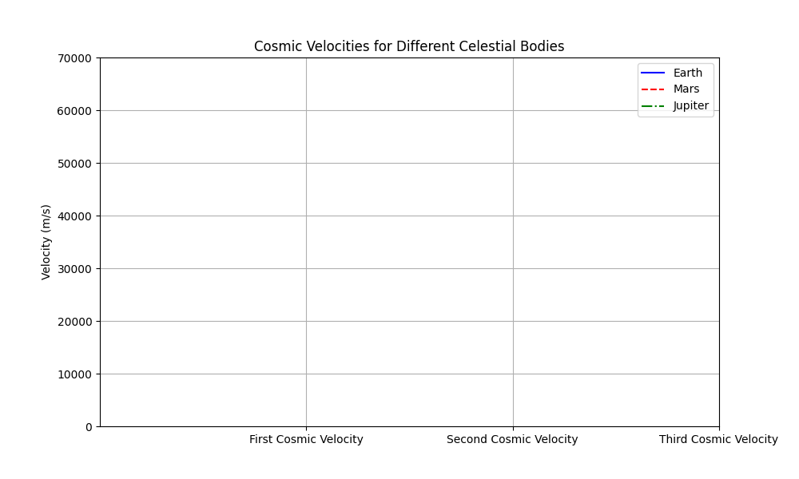

# Escape Velocities and Cosmic Velocities

## Motivation:
The concept of escape velocity is crucial for understanding the conditions required to leave a celestial body's gravitational influence. Extending this concept, the first, second, and third cosmic velocities define the thresholds for orbiting, escaping, and leaving a star system. These principles underpin modern space exploration, from launching satellites to interplanetary missions.

## Task:
### 1. Define the First, Second, and Third Cosmic Velocities
The first, second, and third cosmic velocities are fundamental in space exploration:

- **First Cosmic Velocity (Orbital Velocity)**: This is the velocity required for an object to maintain a circular orbit around a celestial body.
  $$
  V_1 = \sqrt{\frac{GM}{R}}
  $$
  Where:
  - $V_1$ is the first cosmic velocity.
  - $G$ is the gravitational constant ($6.67430 \times 10^{-11} \, \text{m}^3 \, \text{kg}^{-1} \, \text{s}^{-2}$).
  - $M$ is the mass of the celestial body.
  - $R$ is the radius of the celestial body.

- **Second Cosmic Velocity (Escape Velocity)**: This is the velocity needed to escape the gravitational pull of a celestial body and move into space without further propulsion.
  $$
  V_2 = \sqrt{\frac{2GM}{R}}
  $$

- **Third Cosmic Velocity (Escape the Star System)**: This is the velocity required to escape the gravitational influence of the central star (e.g., the Sun) and travel to other star systems.
  $$
  V_3 = \sqrt{\frac{3GM}{R}}
  $$

### 2. Mathematical Derivations and Parameters Affecting These Velocities:
- **Escape Velocity Derivation**: The escape velocity comes from the principle of energy conservation. The total energy (kinetic + potential) at launch should equal the energy at infinity. This gives us the formula for escape velocity:
  $$
  v = \sqrt{\frac{2GM}{R}}
  $$
  
- **Orbital Velocity**: The orbital velocity is derived from the balance between gravitational force and centrifugal force, ensuring a stable orbit.

#### Parameters Affecting Velocities:
1. **Mass of the Celestial Body ($M$)**: Larger mass increases the gravitational pull, requiring higher velocities.
2. **Radius of the Celestial Body ($R$)**: A larger radius results in a lower velocity, as the object is farther from the gravitational center.

### 3. Calculate and Visualize These Velocities for Earth, Mars, and Jupiter

#### Data for Celestial Bodies:
- **Earth**:
  - Mass: $5.972 \times 10^{24} \, \text{kg}$
  - Radius: $6.371 \times 10^{6} \, \text{m}$

- **Mars**:
  - Mass: $6.417 \times 10^{23} \, \text{kg}$
  - Radius: $3.396 \times 10^{6} \, \text{m}$

- **Jupiter**:
  - Mass: $1.898 \times 10^{27} \, \text{kg}$
  - Radius: $6.991 \times 10^{7} \, \text{m}$

#### Python Code for Calculation:

```python
import numpy as np
import matplotlib.pyplot as plt
from matplotlib.animation import FuncAnimation

# Constants
G = 6.67430e-11  # Gravitational constant in m^3 kg^-1 s^-2

# Celestial body parameters (mass in kg, radius in m)
bodies = {
    'Earth': {'mass': 5.972e24, 'radius': 6.371e6, 'color': 'blue', 'label': 'Earth', 'linestyle': '-'},
    'Mars': {'mass': 6.417e23, 'radius': 3.396e6, 'color': 'red', 'label': 'Mars', 'linestyle': '--'},
    'Jupiter': {'mass': 1.898e27, 'radius': 6.991e7, 'color': 'green', 'label': 'Jupiter', 'linestyle': '-.'},
}

# Function to calculate the first, second, and third cosmic velocities
def cosmic_velocities(mass, radius):
    v1 = np.sqrt(G * mass / radius)  # First cosmic velocity (orbital velocity)
    v2 = np.sqrt(2 * G * mass / radius)  # Second cosmic velocity (escape velocity)
    v3 = np.sqrt(3 * G * mass / radius)  # Third cosmic velocity (to escape the star system)
    return v1, v2, v3

# Calculate velocities for each celestial body
velocities = {body: cosmic_velocities(data['mass'], data['radius']) for body, data in bodies.items()}

# Prepare data for each body (for smooth animation)
x_data = [1, 2, 3]  # The positions for the x-axis (First, Second, Third Cosmic Velocity)
y_data = {body: np.array(vel) for body, vel in velocities.items()}  # Store velocities for each body

# Set up the figure and axis
fig, ax = plt.subplots(figsize=(10, 6))
ax.set_xticks([1, 2, 3])
ax.set_xticklabels(['First Cosmic Velocity', 'Second Cosmic Velocity', 'Third Cosmic Velocity'])
ax.set_ylabel('Velocity (m/s)')
ax.set_title('Cosmic Velocities for Different Celestial Bodies')
ax.set_ylim(0, 70000)
ax.grid(True)  # Add grid for better visibility

# Initialize the plot lines for each body with styles
lines = {}
for body, data in bodies.items():
    lines[body] = ax.plot([], [], label=data['label'], color=data['color'], linestyle=data['linestyle'])[0]
ax.legend()

# Add annotations for each cosmic velocity point
annotations = {
    'Earth': [None, None, None],
    'Mars': [None, None, None],
    'Jupiter': [None, None, None],
}

# Initialize the plot (empty lines)
def init():
    for line in lines.values():
        line.set_data([], [])
    for body in annotations.values():
        for ann in body:
            if ann:
                ann.set_visible(False)
    return list(lines.values()) + [ann for body in annotations.values() for ann in body]

# Update function: called for each frame of the animation
def update(frame):
    for body, line in lines.items():
        line.set_data(x_data[:frame], y_data[body][:frame])  # Update line for the current frame

    # Add annotations dynamically
    for body, ann_list in annotations.items():
        for i in range(frame):
            if ann_list[i] is None:
                ann_list[i] = ax.annotate(
                    f"{y_data[body][i]:.2e} m/s", 
                    (x_data[i], y_data[body][i]), 
                    textcoords="offset points", 
                    xytext=(0, 10), 
                    ha='center', color=bodies[body]['color']
                )
            ann_list[i].set_visible(True)
    
    return list(lines.values()) + [ann for body in annotations.values() for ann in body]

# Create the animation with more frames for smoother transitions
ani = FuncAnimation(fig, update, frames=4, init_func=init, interval=800, repeat=False)

# Save the animation as a GIF using Pillow (without ImageMagick)
ani.save("cosmic_velocities_vivid_alternate.gif", writer="Pillow", fps=2.5)

# Show the plot
plt.show()
# Increase the number of frames for smoother animation
ani = FuncAnimation(fig, update, frames=10, init_func=init, interval=400, repeat=False)

# Save the updated animation as a GIF
ani.save("cosmic_velocities_smoother.gif", writer="Pillow", fps=5)

# Show the updated plot
plt.show()
```


### 4. Discuss Their Importance in Space Exploration
First Cosmic Velocity: This is essential for satellites to maintain orbit. For example, the ISS orbits Earth at a speed close to 7.8 km/s, which is nearly the first cosmic velocity of Earth.

Second Cosmic Velocity: This is required for missions aiming to escape Earth's orbit, such as interplanetary probes like Voyager. Earth's second cosmic velocity is approximately 11.2 km/s.

Third Cosmic Velocity: For interstellar travel, we need to achieve the third cosmic velocity to break free from the Sun’s gravitational pull and travel to other star systems.

### 5. Graphical Representations
The plot generated from the Python code will visually compare the first, second, and third cosmic velocities for Earth, Mars, and Jupiter. The comparison demonstrates how the size and mass of a celestial body impact the velocities needed for orbit, escape, and interstellar travel.
