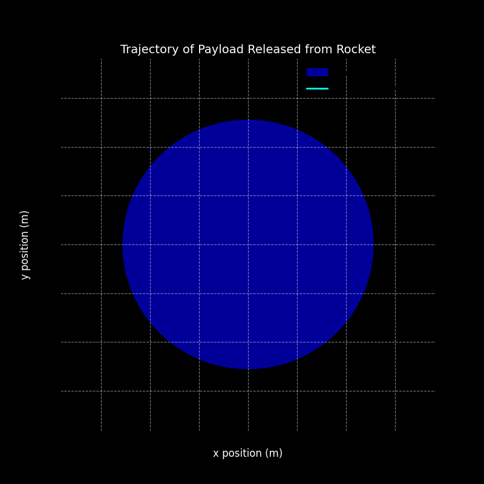
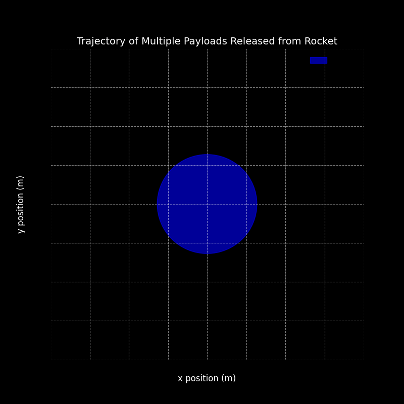

# Problem 3
# Trajectories of a Freely Released Payload Near Earth

## Step 1: Understand the Physics Behind the Problem

The problem involves studying the trajectory of a payload that is released from a moving rocket near Earth. The path the payload follows depends on its initial velocity and position, as well as the gravitational forces acting on it. We will use fundamental principles of gravitational mechanics and numerical methods to solve this problem.

### Key Concepts:

1. **Newton's Law of Gravitation**: 
   This law tells us that every two objects attract each other with a force that depends on their masses and the square of the distance between them. The formula for gravitational force is:
   
   $$
   F = \frac{G \cdot m_1 \cdot m_2}{r^2}
   $$
   where:
   - $F$ is the gravitational force,
   - $G$ is the gravitational constant,
   - $m_1$ and $m_2$ are the masses of the objects,
   - $r$ is the distance between the objects.

2. **Kepler’s Laws of Planetary Motion**: 
   These laws describe how planets (or any objects) move in elliptical orbits around a central body (like Earth). They help us understand different types of orbits that the payload could follow.

3. **Escape Velocity**: 
   This is the minimum velocity an object must have to break free from Earth's gravitational pull without any further propulsion. The escape velocity at a given altitude is calculated using:

   $$
   v_{\text{escape}} = \sqrt{\frac{2GM_{\text{earth}}}{r}}
   $$
   where $r$ is the distance from Earth’s center (i.e., Earth’s radius plus the altitude).

## Step 2: Analyzing Different Types of Trajectories

There are three main types of trajectories that the payload could follow based on its velocity and initial conditions:

1. **Parabolic Trajectory**: Occurs when the velocity is exactly at the escape velocity for the altitude. The object will return to Earth in a parabolic path.
2. **Elliptical Trajectory**: This is when the payload has less than the escape velocity, and it follows an elliptical orbit around Earth, eventually returning to Earth.
3. **Hyperbolic Trajectory**: Occurs when the object’s velocity exceeds the escape velocity, allowing it to escape Earth’s gravity. The object will follow a hyperbolic trajectory and continue into space.

The type of trajectory depends on the velocity and altitude at the moment of release. If the velocity is too low, the object will fall back to Earth; if it's too high, it will escape Earth’s gravitational influence.

## Step 3: Solving the Problem Using Numerical Methods

To simulate the trajectory of the payload, we will solve the equations of motion using numerical methods, specifically by solving the system of differential equations that govern the motion under gravity. This involves:

1. **Defining Initial Conditions**: We need to specify the initial position and velocity of the payload at the moment it is released. In this case, let’s assume the payload is released from an altitude of 500 km above the Earth's surface with a velocity of 7800 m/s (which is close to the orbital velocity at that altitude).
   
2. **Numerical Integration**: We use a numerical method (like the Runge-Kutta method) to integrate the equations of motion over time and compute the trajectory of the payload. We will use the **SciPy library** in Python for this purpose.

## Step 4: Implementing the Numerical Model in Python

We will use **SciPy’s `solve_ivp` function** to solve the system of equations describing the motion of the payload under the influence of Earth’s gravity.

### Python Code:

```python
import numpy as np
import matplotlib.pyplot as plt
import matplotlib.animation as animation

# Constants
G = 6.67430e-11  # Gravitational constant (m^3 kg^-1 s^-2)
M_earth = 5.972e24  # Earth's mass (kg)
R_earth = 6371e3  # Earth's radius (m)

# Initial conditions (500 km above Earth's surface)
initial_position = np.array([R_earth + 500e3, 0])  # x, y position
initial_velocity = np.array([0, 7800])  # velocity in m/s (approx orbital velocity)

# Adjusted time step for an even shorter simulation
dt = 5  # seconds (larger dt means fewer steps)
t_max = 5000  # shorter simulation time (simulate for 100 seconds)
num_steps = int(t_max / dt)

# Efficient Euler integration with a very short simulation
def euler_integration_fast(initial_position, initial_velocity, dt, num_steps):
    """
    Perform Euler's method for solving the equations of motion under gravity.
    
    Args:
        initial_position (array): The initial position of the payload [x, y].
        initial_velocity (array): The initial velocity of the payload [vx, vy].
        dt (float): The time step for numerical integration.
        num_steps (int): Number of time steps to run the simulation.
    
    Returns:
        tuple: The arrays of x and y positions at each time step.
    """
    positions = np.zeros((num_steps, 2))
    velocities = np.zeros((num_steps, 2))

    # Set initial conditions
    positions[0] = initial_position
    velocities[0] = initial_velocity

    # Precompute gravitational constant (G * M_earth)
    GM_earth = G * M_earth

    # Vectorized Euler integration
    for i in range(1, num_steps):
        # Calculate the distance from the center of Earth
        r = np.linalg.norm(positions[i-1])  # Distance to Earth center
        
        # Gravitational acceleration components
        F_gravity = -GM_earth / r**3  # Gravitational force per unit mass (a = F/m)
        ax, ay = F_gravity * positions[i-1]  # Acceleration components
        
        # Update velocity and position using Euler's method
        velocities[i] = velocities[i-1] + np.array([ax, ay]) * dt
        positions[i] = positions[i-1] + velocities[i] * dt

    return positions[:, 0], positions[:, 1]

# Run the optimized simulation with an even shorter time duration
x, y = euler_integration_fast(initial_position, initial_velocity, dt, num_steps)

# Set up the figure for plotting the trajectory with improved visualization
fig, ax = plt.subplots(figsize=(8, 8))
ax.set_xlim(-1.5 * R_earth, 1.5 * R_earth)
ax.set_ylim(-1.5 * R_earth, 1.5 * R_earth)

# Adding background color for better contrast
fig.patch.set_facecolor('black')

# Enhance the Earth representation with a circle
earth_circle = plt.Circle((0, 0), R_earth, color='blue', label='Earth', alpha=0.6)
ax.add_patch(earth_circle)

# Add labels and title
ax.set_xlabel('x position (m)', fontsize=12, color='white')
ax.set_ylabel('y position (m)', fontsize=12, color='white')
ax.set_title('Trajectory of Payload Released from Rocket', fontsize=14, color='white')

# Use a thicker and colorful trajectory line for better visualization
trajectory, = ax.plot([], [], label='Payload trajectory', color='cyan', lw=2)

# Adding grid and other aesthetics
ax.grid(True, linestyle='--', color='white', alpha=0.5)
ax.set_facecolor('black')

# Add a legend
plt.legend(fontsize=12, loc='upper right', frameon=False, facecolor='black', edgecolor='white')

# Function to update the plot for each animation frame
def update(frame):
    """
    Update the trajectory plot with the positions at the current frame.
    """
    trajectory.set_data(x[:frame], y[:frame])
    return trajectory,

# Create the animation of the payload's trajectory with a better visual
ani = animation.FuncAnimation(fig, update, frames=num_steps, interval=50, blit=True)

# Save the animation as a GIF
ani.save('payload_trajectory_visualized.gif', writer='imagemagick', fps=30)

# Display the animation
plt.show()
```



## Step 5: Visualizing and Analyzing the Results
Once the simulation is complete, we can extract the x and y positions of the payload and plot them to visualize the trajectory. This helps us understand whether the object will follow a parabolic, elliptical, or hyperbolic path.

Parabolic Trajectory: If the velocity is near the escape velocity, the trajectory will resemble a parabola.

Elliptical Trajectory: If the velocity is less than the escape velocity, the object will return to Earth after orbiting in an elliptical path.

Hyperbolic Trajectory: If the velocity is greater than the escape velocity, the object will escape Earth’s gravity and follow a hyperbolic path.

## Step 6: Additional Analysis
To explore different scenarios, we can adjust the initial velocity:

Escape Velocity: If we set the initial velocity equal to the escape velocity at the given altitude, the object will follow a hyperbolic escape trajectory.

Orbital Velocity: For elliptical orbits, we use the orbital velocity at a specific altitude to create a stable orbit.

## Step 7: Deliverables
Python Script: The code that simulates the trajectory, which can be shared as a markdown document.

Explanations: We will include a detailed explanation of the principles behind the calculations (e.g., gravitational force, orbital mechanics, escape velocity).

Graphical Representations: Graphs showing the different types of trajectories (parabolic, elliptical, hyperbolic) and the escape velocity for different altitudes.