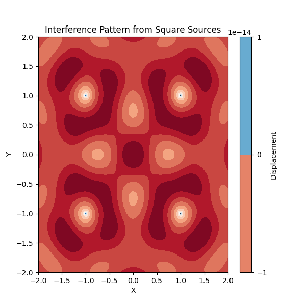
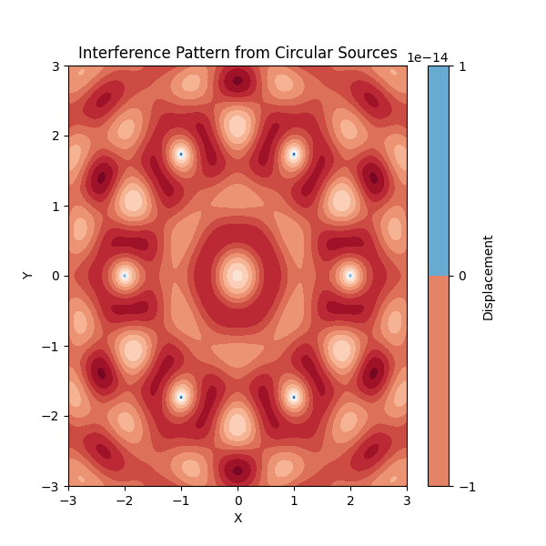
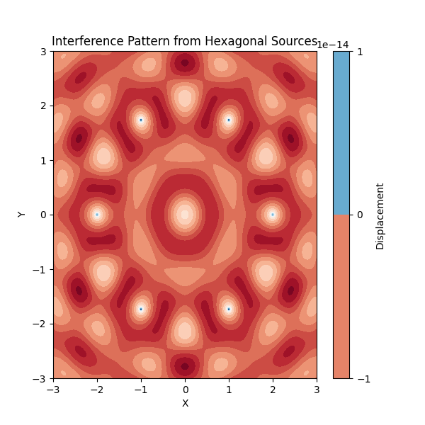
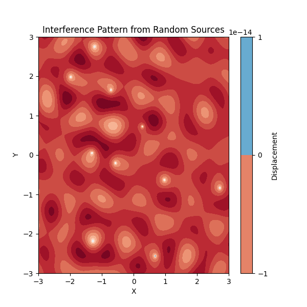

# Problem 1
# Wave Interference Patterns from Point Sources at Polygon Vertices

## Overview

This task involves analyzing the interference patterns formed on the water surface due to the superposition of waves emitted from point sources placed at the vertices of a regular polygon. The primary concepts used in the task include the wave equation, the principle of superposition, and the visualization of interference patterns.

---

## Basic Concepts

### 1. Wave Equation

The wave equation that describes the displacement of the water surface due to a wave emitted from a point source is:

$$
\eta(x, y, t) = \frac{A}{\sqrt{r}} \cdot \cos(k r - \omega t + \phi)
$$

Where:
- $\eta(x, y, t)$ is the displacement at point $(x, y)$ at time $t$.
- $A$ is the amplitude of the wave.
- $r = \sqrt{(x - x_0)^2 + (y - y_0)^2}$ is the distance from the source $(x_0, y_0)$ to the point $(x, y)$.
- $k = \frac{2\pi}{\lambda}$ is the wave number, related to the wavelength $\lambda$.
- $\omega = 2\pi f$ is the angular frequency, related to the frequency $f$.
- $\phi$ is the initial phase of the wave.

### 2. Superposition Principle

The principle of superposition states that when multiple waves intersect, the resulting wave displacement at any point is the sum of the displacements from each individual wave. Mathematically, the total displacement is:

$$
\eta_{\text{sum}}(x, y, t) = \sum_{i=1}^{N} \eta_i(x, y, t)
$$

Where:
- $N$ is the number of sources (the vertices of the polygon).
- $\eta_i(x, y, t)$ represents the wave from the $i$-th source.

---

## Step-by-Step Approach

### Step 1: Choose a Regular Polygon

Start by selecting a regular polygon for placing the point sources. Common choices are:
- **Equilateral triangle** (3 sides/vertices)
- **Square** (4 sides/vertices)
- **Pentagon** (5 sides/vertices)
- **Hexagon** (6 sides/vertices)

### Step 2: Position the Sources at the Vertices

Once you've chosen a polygon, position point wave sources at the vertices. For example, for a **square** centered at the origin with side length \(L\), the vertex positions are:
- $(x_1, y_1) = (-L/2, -L/2)$
- $(x_2, y_2) = (L/2, -L/2)$
- $(x_3, y_3) = (L/2, L/2)$
- $(x_4, y_4) = (-L/2, L/2)$

These are the positions of the 4 wave sources.

### Step 3: Write the Wave Equations

For each wave source, the displacement $\eta_i(x, y, t)$ at any point $(x, y)$ is given by the wave equation:

$$
\eta_i(x, y, t) = \frac{A}{\sqrt{r_i}} \cdot \cos(k r_i - \omega t + \phi)
$$

Where $r_i = \sqrt{(x - x_i)^2 + (y - y_i)^2}$ is the distance from the source $(x_i, y_i)$ to the point $(x, y)$.

### Step 4: Superposition of Waves

The total displacement at any point $(x, y)$ is the sum of the displacements from all sources:

$$
\eta_{\text{sum}}(x, y, t) = \sum_{i=1}^{N} \eta_i(x, y, t)
$$

You will calculate the displacement from all sources at each point on the water surface and add them together.

### Step 5: Analyze the Interference Patterns

Once you have the total displacement, analyze the interference patterns:
- **Constructive Interference** occurs when the displacements add up in the same direction, resulting in a larger displacement (wave amplification).
- **Destructive Interference** occurs when the displacements cancel each other out, resulting in a smaller displacement or zero displacement (wave cancellation).

### Step 6: Visualization

Use tools like Python and Matplotlib to visualize the interference patterns. A contour plot will help you identify regions of constructive and destructive interference.

---

## Python Code Implementation

Here's a basic Python script to simulate and visualize the wave interference patterns:

```python
import numpy as np
import matplotlib.pyplot as plt
import matplotlib.animation as animation
from matplotlib.animation import PillowWriter

# Parameters
A = 1  # Amplitude
lambda_ = 1  # Wavelength
f = 1  # Frequency
omega = 2 * np.pi * f  # Angular frequency
k = 2 * np.pi / lambda_  # Wave number
phi = 0  # Initial phase

# Define source positions (for a square, 4 vertices)
sources = [(-1, -1), (1, -1), (1, 1), (-1, 1)]

# Define the function to calculate displacement from a single source
def wave(x, y, x0, y0, t):
    r = np.sqrt((x - x0)**2 + (y - y0)**2)  # Distance from the source
    return A / np.sqrt(r) * np.cos(k * r - omega * t + phi)  # Displacement

# Create a grid of points on the water surface
x_vals = np.linspace(-2, 2, 400)
y_vals = np.linspace(-2, 2, 400)
X, Y = np.meshgrid(x_vals, y_vals)

# Set up the figure and axis
fig, ax = plt.subplots(figsize=(6, 6))

# Initial empty contour plot (it will be updated in each frame)
contour = ax.contourf(X, Y, np.zeros(X.shape), 20, cmap='RdBu')
fig.colorbar(contour, ax=ax, label="Displacement")
ax.set_title("Interference Pattern from Square Sources")
ax.set_xlabel("X")
ax.set_ylabel("Y")

# Function to update the plot for each frame
def update(t):
    Z = np.zeros(X.shape)
    for (x0, y0) in sources:
        Z += wave(X, Y, x0, y0, t)
    
    # Clear the previous contour plot
    for c in ax.collections:
        c.remove()

    # Create new contour plot for the current time step
    ax.contourf(X, Y, Z, 20, cmap='RdBu')
    return ax.collections

# Create the animation
ani = animation.FuncAnimation(fig, update, frames=np.linspace(0, 2*np.pi, 100), interval=50)

# Save the animation as a GIF using PillowWriter
writer = PillowWriter(fps=20)
ani.save('interference_pattern.gif', writer=writer)

plt.show()
```





# Conclusion of Visualizations

Throughout this exploration, we created and visualized various wave interference patterns, each offering unique insights into the behavior of waves emitted from multiple sources. Here's a summary of the different patterns and the conclusions we can draw from them:

## 1. Square Source Arrangement
- **Pattern Overview**: By placing wave sources at the vertices of a square, we observed symmetrical interference patterns with regions of constructive and destructive interference.
- **Insights**: This arrangement showed how regular geometric configurations lead to predictable interference patterns. The square configuration highlights the symmetric nature of wave interactions in structured environments.

## 2. Circular Source Arrangement
- **Pattern Overview**: When the wave sources were arranged in a circle, the interference pattern became more circular, with radial symmetry emerging from the central point.
- **Insights**: This pattern demonstrated the effect of rotational symmetry on wave interference. The waves' interaction resulted in clear regions of constructive interference along the circle's radius and destructive interference near the center. It was an excellent demonstration of how wave sources placed in circular symmetry impact the resulting interference.

## 3. Hexagonal Source Arrangement
- **Pattern Overview**: The interference pattern from six sources arranged at the vertices of a hexagon resulted in an intricate and symmetrical pattern with sixfold symmetry.
- **Insights**: This configuration further emphasized how the symmetry of the source placement influences the interference results. The hexagonal arrangement produced complex interference regions that could not be easily predicted from simple geometric shapes, providing a visually striking example of wave behavior.

## 4. Random Source Placement
- **Pattern Overview**: With randomly placed sources on the surface, the resulting interference pattern was irregular and dynamic, with no clear symmetry. This randomness introduced a new level of unpredictability.
- **Insights**: The random arrangement of wave sources provided a more chaotic interference pattern, which emphasized how wave interference becomes more unpredictable and complex when the sources are not in a regular arrangement. This visualization demonstrated the real-world unpredictability of wave interactions when the sources are distributed arbitrarily.

## General Insights from All Visualizations:
- **Superposition Principle**: In all patterns, we observed the core principle of wave superposition—at each point, the displacement is the sum of the contributions from all sources. This is visible in the interference patterns, where areas of constructive interference show amplification, while destructive interference regions show cancellation.
- **Effect of Source Arrangement**: The shape and symmetry of the source arrangement significantly influence the resulting interference patterns. Regular geometric arrangements (square, circular, hexagonal) create distinct, predictable patterns, while random placements result in chaotic, less predictable behavior.
- **Wave Behavior**: These visualizations helped to illustrate fundamental concepts of wave mechanics, including constructive and destructive interference, and how waveforms interact in a space over time. The animations effectively demonstrated how waves evolve and interfere with each other dynamically.

## Conclusion:
These visualizations collectively help us understand how the arrangement of wave sources affects the overall interference pattern and how we can visualize and analyze wave interactions in different scenarios. Whether in structured geometries or random setups, the core principles of wave interference—constructive and destructive interference—are always at play, and these patterns offer a visually engaging way to study and comprehend the underlying physics of wave phenomena.
