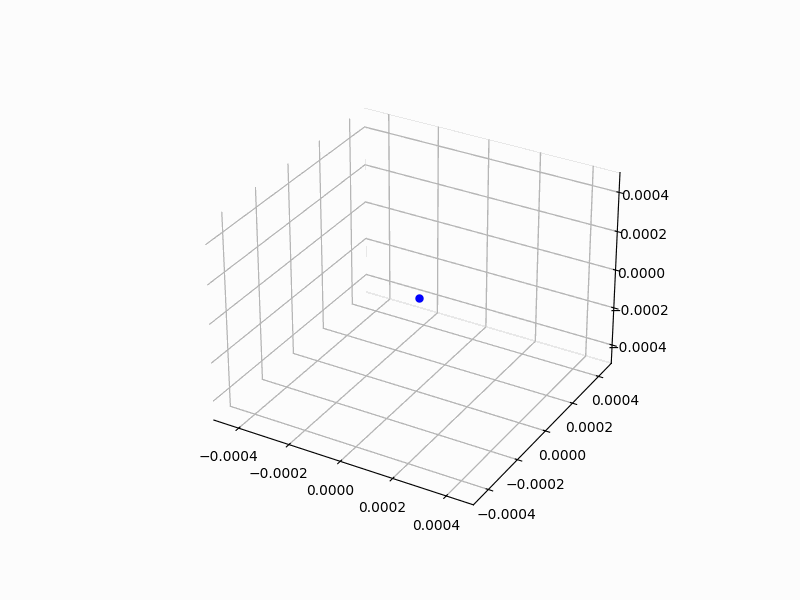
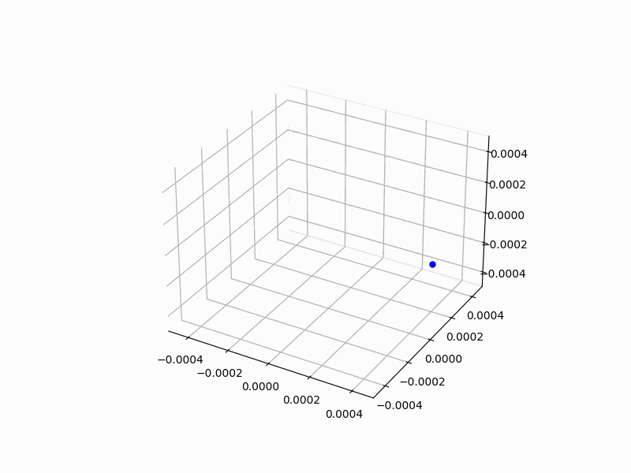
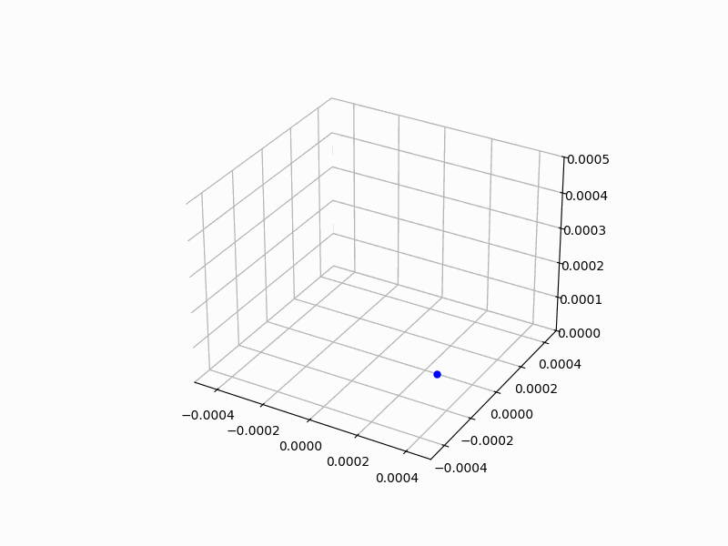
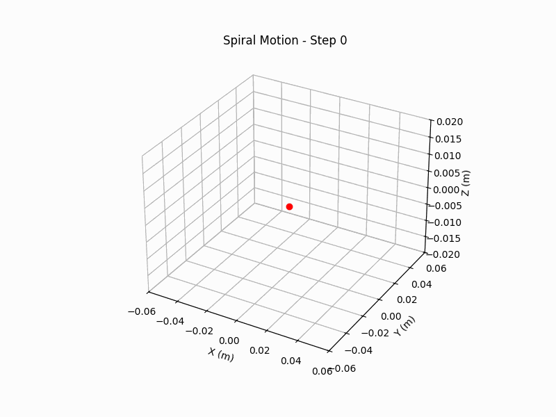

# Problem 1
# Simulating the Effects of the Lorentz Force

## 1. **The Lorentz Force in Detail**

The **Lorentz force** is the force experienced by a charged particle moving through electric and magnetic fields. The equation governing this force is:

$$
\vec{F} = q \vec{E} + q \vec{v} \times \vec{B}
$$

Where:
- **$q$** is the charge of the particle.
- **$\vec{E}$** is the electric field vector.
- **$\vec{v}$** is the velocity vector of the particle.
- **$\vec{B}$** is the magnetic field vector.
- **$\times$** represents the cross product, which makes the magnetic force always perpendicular to the velocity of the particle.

## 2. **Understanding Electric and Magnetic Fields**

Let’s break down how each field interacts with the charged particle:

### a. **Electric Field ($\vec{E}$)**

The electric field applies a force directly on a charged particle, either pushing it in the direction of the field (if the charge is positive) or pulling it in the opposite direction (if the charge is negative).

- For a particle with charge $q$, the force is given by:
  
  $$
  \vec{F}_E = q \vec{E}
  $$

- This force results in the particle accelerating in the direction of the electric field if the charge is positive or opposite if negative.

### b. **Magnetic Field ($\vec{B}$)**

The magnetic field influences a charged particle that is moving. Unlike the electric field, the magnetic force is **always perpendicular** to both the velocity of the particle and the magnetic field.

- The magnetic force is given by:
  
  $$
  \vec{F}_B = q (\vec{v} \times \vec{B})
  $$

- This results in the particle experiencing a force that causes its path to curve. The magnitude of the force depends on the speed of the particle and the angle between its velocity and the magnetic field.
  
- If the velocity vector is perpendicular to the magnetic field, the particle will move in a circular trajectory with a radius that depends on its speed, mass, charge, and the magnetic field strength.

## 3. **Types of Particle Motion**

The particle's motion can vary based on the relative directions and magnitudes of the electric and magnetic fields. Let's look at some typical trajectories:

### a. **Motion in a Uniform Magnetic Field**

In a uniform magnetic field, if the particle’s velocity is perpendicular to the magnetic field, the magnetic force will cause the particle to move in a **circular** path. The radius of the circle, called the **Larmor radius**, is given by:

$$
r = \frac{mv_{\perp}}{|q|B}
$$

Where:
- $m$ is the mass of the particle.
- $v_{\perp}$ is the component of the velocity perpendicular to the magnetic field.
- $B$ is the magnetic field strength.

This results in **uniform circular motion**, where the particle's speed remains constant, but its direction changes. This is called **cyclotron motion**, and is observed in devices like cyclotrons or in cosmic particle motion.

### b. **Motion in a Combined Electric and Magnetic Field**

When both electric and magnetic fields are present, the motion becomes more complicated. The **electric field** accelerates the particle in the direction of the field, while the **magnetic field** causes the particle to spiral or curve. This leads to **helical motion**, where the particle moves in a spiral trajectory.

The direction of the spiral depends on the relative strengths and directions of the two fields. The electric field may also cause a **drift** in the direction of the field, which modifies the trajectory.

### c. **Crossed Electric and Magnetic Fields**

When the electric and magnetic fields are perpendicular (i.e., "crossed fields"), the motion of the particle can be even more interesting. In this case:
- The particle will experience both the drift due to the electric field and the curvature due to the magnetic field.
- The combination of these two effects can lead to **complex, spiral-like** or even **oscillatory** motion depending on the relative strength of the fields.

This configuration is often seen in phenomena like the **Hall Effect** and in devices like **magnetic confinement systems** (e.g., Tokamaks for plasma confinement).

## 4. **Simulation of Particle Motion**

Now that we understand the theoretical principles, let’s look into how we can simulate this in Python. The goal is to compute the trajectory of a particle in response to different electric and magnetic field configurations.

### a. **Euler Method for Numerical Integration**

We can use numerical methods like Euler’s method or Runge-Kutta methods to solve the equations of motion. The basic idea is to update the particle's position and velocity at each timestep, using the Lorentz force to calculate the acceleration.

**Euler's method** is simple, but not the most accurate for complex systems. It updates the position and velocity by assuming the acceleration is constant over a small timestep:

$$
\vec{v}(t + \Delta t) = \vec{v}(t) + \vec{a} \Delta t
$$

$$
\vec{r}(t + \Delta t) = \vec{r}(t) + \vec{v}(t) \Delta t
$$

Where:
- $\vec{a} = \frac{\vec{F}}{m}$ is the acceleration from the force.
- $\Delta t$ is the small timestep used for updating the particle's position and velocity.

This method is simple to implement but can accumulate errors, especially for longer simulations. For more accurate results, we can use more sophisticated methods like **Runge-Kutta**.

### b. **Runge-Kutta Method (RK4)**

The Runge-Kutta method is more accurate than Euler’s method and provides a better approximation of the particle's motion. The fourth-order Runge-Kutta method (RK4) is widely used for solving differential equations.

It works by evaluating the acceleration at several intermediate points within each timestep, which provides a more accurate estimate of the new position and velocity.

Here is a basic structure for implementing RK4 to solve the particle's motion:

```python
import numpy as np
import matplotlib.pyplot as plt
from PIL import Image
import os
import shutil

# Constants
q = 1.6e-19  # Charge of the particle (C)
m = 9.11e-31  # Mass of the particle (kg)
B = np.array([0, 0, 1e-3], dtype=np.float64)  # Magnetic field along z-axis (T)
E = np.array([0, 0, 0], dtype=np.float64)  # No electric field in this example
v_initial = np.array([1e5, 0, 0], dtype=np.float64)  # Initial velocity in x-direction (m/s)

# Time step and total time
dt = 1e-9  # Time step (s)
T = 1e-6  # Total time (s)
steps = int(T / dt)

# Initial conditions
r = np.array([0, 0, 0], dtype=np.float64)  # Initial position (m)
v = v_initial * 0.1  # Reduced velocity to keep the particle inside a smaller region

# Store the trajectory for plotting
trajectory = []

# Function to compute the Lorentz force
def lorentz_force(v, r, q, m, E, B):
    F = q * (E + np.cross(v, B))  # Lorentz force
    a = F / m  # Acceleration
    return a

# Initialize the figure and 3D axis for the animation
fig = plt.figure(figsize=(8, 6))
ax = fig.add_subplot(111, projection='3d')
ax.set_xlim(-0.5e-3, 0.5e-3)
ax.set_ylim(-0.5e-3, 0.5e-3)
ax.set_zlim(-0.5e-3, 0.5e-3)

# Particle plot
particle, = ax.plot([], [], [], 'bo', markersize=5)  # Particle position
trail, = ax.plot([], [], [], 'b-', lw=0.5)  # Trajectory plot

# Initialize empty data for the trajectory
trajectory_data = []

# Create a directory to store the frames
if not os.path.exists('frames'):
    os.makedirs('frames')

# Function to update particle position and trajectory manually
def update_plot(frame):
    global r, v, trajectory_data
    
    # Compute the acceleration due to the Lorentz force
    a = lorentz_force(v, r, q, m, E, B)
    
    # Update velocity and position using Euler's method
    v += a * dt
    r += v * dt
    
    # Clamp the position to stay inside the plot boundaries (smaller range)
    r = np.clip(r, [-0.5e-3, -0.5e-3, -0.5e-3], [0.5e-3, 0.5e-3, 0.5e-3])  # Keeps particle inside the box
    
    # If the particle touches the boundary, stop the animation
    if np.any(np.abs(r) >= 0.5e-3):  # Check if any coordinate exceeds the boundary
        print(f"Particle touched the boundary at step {frame}")
        return False  # Return False to stop the animation
    
    # Append the new position to the trajectory
    trajectory_data.append(r.copy())
    trajectory_array = np.array(trajectory_data)
    
    # Ensure the data is passed as a sequence (array)
    particle.set_data([r[0]], [r[1]])  # Updating X, Y as sequences
    particle.set_3d_properties([r[2]])  # Updating Z as sequence
    
    # Update the trajectory (path of the particle)
    trail.set_data(trajectory_array[:, 0], trajectory_array[:, 1])  # Updating X, Y
    trail.set_3d_properties(trajectory_array[:, 2])  # Updating Z
    
    # Save the current figure as an image
    plt.savefig(f"frames/frame_{frame}.png")
    
    return True  # Return True to continue the animation

# Generate frames and store them as images
for step in range(steps):
    if not update_plot(step):
        break  # Stop the animation if the particle touches the boundary

# Create a GIF from the saved frames
frames = []
for step in range(steps):
    frame_path = f"frames/frame_{step}.png"
    if os.path.exists(frame_path):
        frames.append(Image.open(frame_path))

# Save the GIF
frames[0].save('lorentz_force_3d_animation.gif', save_all=True, append_images=frames[1:], loop=0, duration=1000 / 30)

# Optionally display the final animation
plt.show()

# Clean up the temporary frame images
shutil.rmtree('frames')
```





# Description of the Lorentz Force Simulation Code

This Python code simulates the motion of a **charged particle** in a **magnetic field** and creates a **3D animation** of its trajectory, which is then saved as a **GIF**.

## Key Features:
1. **Helical Motion Simulation**:
   - The particle moves in a **spiral or helical** trajectory due to the Lorentz force caused by its interaction with the magnetic field.
   - The **magnetic field** is applied along the z-axis, and the particle's motion is divided into two components:
     - **Perpendicular velocity**: Causes the particle to move in a circular path around the magnetic field.
     - **Parallel velocity**: Moves the particle along the z-axis, creating the spiral motion.

2. **Physical Setup**:
   - The particle has a **charge $q$** and **mass $m$**, which influences how it responds to the magnetic field.
   - The **magnetic field $\mathbf{B}$** is defined along the z-axis, affecting the particle's trajectory.

3. **Lorentz Force Calculation**:
   - The **Lorentz force** is given by the equation $\mathbf{F} = q (\mathbf{v} \times \mathbf{B})$, where $\mathbf{v}$ is the velocity vector of the particle and $\mathbf{B}$ is the magnetic field vector.
   - This force acts perpendicular to the velocity of the particle and results in circular motion in the XY-plane and linear motion along the Z-axis.

4. **Euler’s Method for Numerical Integration**:
   - The position and velocity of the particle are updated over small time steps using **Euler’s method**.
   - The particle's position is updated as $\mathbf{r}(t + dt) = \mathbf{r}(t) + \mathbf{v}(t) \cdot dt$, and the velocity is updated using the acceleration obtained from the Lorentz force.

5. **Visualization**:
   - A **3D plot** is created using **Matplotlib** to visualize the particle's motion in space.
   - The trajectory is plotted as a path behind the particle as it moves in 3D space.
   - The particle’s current position is plotted as a **blue dot**.

6. **Animation**:
   - The **Matplotlib animation** functionality is used to update the plot at each time step, simulating the motion of the particle.
   - Each frame of the animation is saved as an image using `plt.savefig()`.

7. **GIF Creation**:
   - After generating all frames, the **Pillow library** is used to convert the frames into a GIF. 
   - The frames are combined into a **GIF** with a specified frame rate (30 frames per second in this case).
   - The GIF is saved as `lorentz_force_3d_animation.gif` and can be viewed in any image viewer or browser.

8. **Cleanup**:
   - After the GIF is created, the **temporary frame images** used for the animation are deleted to clean up resources.

## Workflow of the Code:
1. **Initial Setup**:
   - Constants such as the charge $q$, mass $m$, magnetic field $\mathbf{B}$, and initial velocity are defined.
   - The **initial position** and **velocity** of the particle are set, with the particle moving in a circular path and also having a velocity along the z-axis to elevate.

2. **Calculation of Lorentz Force**:
   - At each time step, the **Lorentz force** is calculated using the current velocity and the magnetic field.
   - The **acceleration** due to the force is computed, and the particle’s velocity and position are updated accordingly.

3. **Updating the Plot**:
   - For each time step, the particle’s position is updated on the 3D plot.
   - The path traced by the particle is recorded, and the trajectory is updated on the plot.

4. **Saving Frames**:
   - Each frame of the simulation is saved as a PNG image using `plt.savefig()` within the `update_plot()` function.

5. **Creating the GIF**:
   - After generating all frames, the images are loaded and combined into a GIF using the **Pillow** library. The GIF is saved with a frame duration of 1000/30 ms to achieve a 30 FPS animation.

6. **Displaying and Saving**:
   - The final animation is displayed in the plot window, and the GIF is saved in the working directory.

7. **Cleanup**:
   - The temporary files used for generating frames are deleted after the GIF is created.

## Output:
- The final output is a **GIF file** (`lorentz_force_3d_animation.gif`) that shows the **helical motion** of the charged particle in 3D space under the influence of a magnetic field.
- The particle moves in a circular path in the XY-plane while **elevating** along the Z-axis, visualizing a typical **spiral trajectory** of a charged particle in a magnetic field.

## Additional Considerations:
- **Customization**: You can adjust parameters such as the particle's initial velocity, the magnetic field strength, and the time step to explore how different conditions affect the motion.
- **Efficiency**: Euler's method is simple but can accumulate error over time. For higher accuracy, more advanced numerical methods (like the Runge-Kutta method) can be used.

