# Problem 1
# Calculating Equivalent Resistance Using Graph Theory

## 1. Circuit Representation as a Graph

In graph theory, a **graph** consists of **nodes (vertices)** and **edges (arcs)**. In the context of circuits:

- **Nodes (Vertices)**: These represent the **junctions** or points in the circuit where different components like resistors, capacitors, or inductors meet. Essentially, these are the points where electrical connections are made.
  
- **Edges (Arcs)**: These represent the **resistors** or any other components in the circuit, where the **weight of the edge** corresponds to the **resistance** value of the resistor. For instance, if there's a 10 Ω resistor between two junctions, the edge connecting those two nodes would have a weight of 10 Ω.

**Why use graphs?**

- Using graphs provides a **structured and systematic way** to model and analyze circuits. Graph theory allows us to manipulate and simplify complex circuits by identifying patterns, like series and parallel connections, through algorithms.

## 2. Series and Parallel Connections

To understand how to calculate equivalent resistance in a circuit, it's essential to know what **series** and **parallel connections** are, and how they affect the total resistance.

### Series Connections:
- **Definition**: Resistors are said to be in series if they are connected end-to-end, meaning the current flows through each resistor one after another, without any branching.
  
- **Example**: If you have two resistors $R_1$ and $R_2$ in series, the total or equivalent resistance $R_{\text{eq}}$ is simply the sum of their individual resistances:
  $$
  R_{\text{eq}} = R_1 + R_2
  $$
  
- **Graph Representation**: In the graph, the resistors in series will be represented by edges that directly connect two nodes with no intermediate branches in between.

### Parallel Connections:
- **Definition**: Resistors are said to be in parallel if they are connected across the same two nodes (junctions), creating multiple paths for the current to flow.

- **Example**: If you have two resistors $R_1$ and $R_2$ in parallel, the equivalent resistance $R_{\text{eq}}$ is calculated by the following formula:
  $$
  \frac{1}{R_{\text{eq}}} = \frac{1}{R_1} + \frac{1}{R_2}
  $$
  This formula shows that the total resistance of parallel resistors is always less than the smallest individual resistor.

- **Graph Representation**: In the graph, parallel resistors will be represented by edges that start and end at the same pair of nodes, indicating multiple paths.

## 3. Steps in the Algorithm to Calculate Equivalent Resistance

We use an **iterative algorithm** to simplify the graph step by step by reducing series and parallel resistors. Here's the process:

1. **Detect and Reduce Series Connections**: 
   - When you identify two resistors in series, replace them with a new edge that has the resistance equal to the sum of the individual resistances.

2. **Detect and Reduce Parallel Connections**: 
   - When you identify two resistors in parallel, replace them with a new edge that has the resistance equal to the result of the parallel formula.

3. **Repeat**: 
   - This process is repeated iteratively until only a single equivalent resistor remains. This resistor represents the **total resistance** of the entire circuit.

### Detailed Algorithm (Step-by-Step):

```plaintext
function calculate_equivalent_resistance(graph, start_node, end_node):

    while graph has more than 2 nodes:
        # Step 1: Find series nodes
        series_nodes = find_series_nodes(graph)
        for node in series_nodes:
            combine_series(graph, node)
        
        # Step 2: Find parallel edges
        parallel_edges = find_parallel_edges(graph)
        for (u, v) in parallel_edges:
            combine_parallel(graph, u, v)
    
    # After simplification, only two nodes left
    return resistance_of_edge(graph, start_node, end_node)


function find_series_nodes(graph):
    series_nodes = []
    for node in graph.nodes:
        # A node in series has exactly 2 neighbors
        if degree(node) == 2 and node != start_node and node != end_node:
            series_nodes.append(node)
    return series_nodes


function combine_series(graph, node):
    neighbors = graph.neighbors(node)  # Exactly 2 neighbors: n1, n2
    r1 = graph.get_edge_data(node, neighbors[0])['resistance']
    r2 = graph.get_edge_data(node, neighbors[1])['resistance']
    # Equivalent resistance in series: sum
    r_eq = r1 + r2
    
    # Remove node and its edges, add new edge between neighbors
    graph.remove_node(node)
    graph.add_edge(neighbors[0], neighbors[1], resistance=r_eq)


function find_parallel_edges(graph):
    # Parallel edges are multiple edges between the same two nodes
    parallel_pairs = []
    for (u, v) in graph.edges:
        if graph.number_of_edges(u, v) > 1:
            parallel_pairs.append((u, v))
    return parallel_pairs


function combine_parallel(graph, u, v):
    edges = graph.get_all_edges(u, v)  # multiple edges with resistance
    # Calculate equivalent resistance in parallel:
    r_eq = 1 / sum(1 / edge['resistance'] for edge in edges)
    # Remove all parallel edges between u and v
    graph.remove_edges_between(u, v)
    # Add a single edge with equivalent resistance
    graph.add_edge(u, v, resistance=r_eq)

```
## 4. Handling Nested Series and Parallel Configurations

In real-world circuits, resistors often appear in more complex arrangements, like nested series or parallel configurations. Here’s how we can handle this complexity:

### Nested Series and Parallel Combinations:
A circuit can have a combination of resistors in series and parallel, and some of those combinations might themselves have nested configurations. For example, two resistors in series may be in parallel with another resistor, or vice versa.

### How to Solve Nested Configurations:
- **Step 1**: Start by simplifying the innermost combination first. For example, if you have two resistors in series inside a parallel configuration, calculate their equivalent resistance as if they were a single resistor and simplify the circuit.
- **Step 2**: After simplifying the inner combinations, treat the simplified result as a new single resistor and continue simplifying the circuit.
- **Step 3**: Continue this process until you reduce the entire circuit to just one equivalent resistance.

## 5. Example Walkthrough with Nested Connections

Let’s take a slightly more complex circuit with nested series and parallel resistors:
```python 
import networkx as nx
import matplotlib.pyplot as plt
import matplotlib.patches as mpatches

def draw_graph(G, highlight_edges=None, highlight_color='#d62728', title=''):
    start_node = 'B+'
    end_node = 'B-'

    # Use spring layout for broad compatibility (no SciPy required)
    pos = nx.spring_layout(G, seed=42)

    plt.figure(figsize=(12, 8))
    
    # Node colors and shapes with pastel tones
    node_colors = []
    node_shapes = {}
    for node in G.nodes:
        if node == start_node:
            node_colors.append('#a6cee3')  # pastel blue
            node_shapes[node] = 'o'
        elif node == end_node:
            node_colors.append('#fb9a99')  # pastel red/pink
            node_shapes[node] = 's'
        else:
            node_colors.append('#b2df8a')  # pastel green
            node_shapes[node] = 'o'

    unique_shapes = set(node_shapes.values())
    for shape in unique_shapes:
        nodes_with_shape = [n for n in G.nodes if node_shapes[n] == shape]
        nx.draw_networkx_nodes(
            G, pos,
            nodelist=nodes_with_shape,
            node_color=[node_colors[list(G.nodes).index(n)] for n in nodes_with_shape],
            node_shape=shape,
            node_size=900,
            edgecolors='black',
            linewidths=1.5
        )
    
    # Edges excluding highlighted edges
    if highlight_edges:
        normalized_highlights = {(min(u,v), max(u,v)) for u,v in highlight_edges}
        default_edges = []
        for u, v, key in G.edges(keys=True):
            if (min(u,v), max(u,v)) not in normalized_highlights:
                default_edges.append((u, v))
    else:
        default_edges = [(u, v) for u, v, k in G.edges(keys=True)]
    
    # Draw default edges with curves and pastel gray color
    nx.draw_networkx_edges(
        G, pos, edgelist=default_edges, width=3,
        edge_color='#999999', style='solid',
        connectionstyle='arc3,rad=0.15'
    )
    
    # Draw highlighted edges thicker with specified color and curve
    if highlight_edges:
        nx.draw_networkx_edges(
            G, pos, edgelist=highlight_edges, width=5,
            edge_color=highlight_color, style='solid',
            connectionstyle='arc3,rad=0.2'
        )
    
    # Draw node labels with white rounded box for readability
    for node, (x, y) in pos.items():
        plt.text(x, y, node, fontsize=16, fontweight='bold', ha='center', va='center',
                 bbox=dict(facecolor='white', edgecolor='black', boxstyle='round,pad=0.3'))
    
    # Edge labels with spacing to avoid overlap
    edge_labels = {}
    parallel_counts = {}
    for u, v, data in G.edges(data=True):
        key = (min(u,v), max(u,v))
        parallel_counts[key] = parallel_counts.get(key, 0) + 1
    
    parallel_label_index = {}
    
    def get_label_pos(u, v):
        key = (min(u,v), max(u,v))
        count = parallel_counts.get(key, 1)
        if count == 1:
            return 0.5
        idx = parallel_label_index.get(key, 0)
        parallel_label_index[key] = idx + 1
        return 0.3 + (idx * 0.4 / (count - 1)) if count > 1 else 0.5
    
    labels_pos = {}
    for u, v, data in G.edges(data=True):
        key = (min(u,v), max(u,v))
        if key not in edge_labels:
            edge_labels[key] = f"R={data['resistance']:.2f}"
            labels_pos[key] = get_label_pos(u, v)
    
    for (u, v), label in edge_labels.items():
        nx.draw_networkx_edge_labels(
            G, pos,
            edge_labels={(u, v): label},
            label_pos=labels_pos[(min(u,v), max(u,v))],
            font_color='#6a1b9a',  # deep purple
            font_size=14,
            bbox=dict(facecolor='white', edgecolor='#6a1b9a', boxstyle='round,pad=0.3', alpha=0.9)
        )
    
    plt.title(title, fontsize=20, fontweight='bold', color='#333333')
    plt.axis('off')

    start_patch = mpatches.Patch(color='#a6cee3', label='Start Node (B+)')
    end_patch = mpatches.Patch(color='#fb9a99', label='End Node (B-)')
    mid_patch = mpatches.Patch(color='#b2df8a', label='Intermediate Nodes')
    plt.legend(handles=[start_patch, mid_patch, end_patch], loc='lower left', fontsize=12)
    
    plt.tight_layout()
    plt.show()

def simplify_step(G, start, end):
    series_nodes = [node for node in G.nodes if node not in (start, end) and G.degree(node) == 2]
    if series_nodes:
        node = series_nodes[0]
        neighbors = list(G.neighbors(node))
        
        key1 = list(G[node][neighbors[0]].keys())[0]
        r1 = G[node][neighbors[0]][key1]['resistance']
        
        key2 = list(G[node][neighbors[1]].keys())[0]
        r2 = G[node][neighbors[1]][key2]['resistance']
        
        r_eq = r1 + r2
        highlight_edges = [(node, neighbors[0]), (node, neighbors[1])]
        
        draw_graph(G, highlight_edges, '#d62728', f"Step: Combine series edges at node {node}")
        
        G.remove_node(node)
        
        if G.has_edge(neighbors[0], neighbors[1]):
            key_old = list(G[neighbors[0]][neighbors[1]].keys())[0]
            old_r = G[neighbors[0]][neighbors[1]][key_old]['resistance']
            r_eq = 1 / (1/old_r + 1/r_eq)
            G.remove_edge(neighbors[0], neighbors[1])
        
        G.add_edge(neighbors[0], neighbors[1], resistance=r_eq)
        
        draw_graph(G, [(neighbors[0], neighbors[1])], '#2ca02c', "After combining series edges")
        return True
    
    for u, v in G.edges:
        if G.number_of_edges(u, v) > 1:
            resistances = [edata['resistance'] for key, edata in G[u][v].items()]
            r_eq = 1 / sum(1/r for r in resistances)
            highlight_edges = [(u, v)] * len(resistances)
            
            draw_graph(G, [(u,v)], '#d62728', f"Step: Combine parallel edges between {u} and {v}")
            
            G.remove_edges_from([(u, v, key) for key in list(G[u][v].keys())])
            G.add_edge(u, v, resistance=r_eq)
            
            draw_graph(G, [(u, v)], '#2ca02c', "After combining parallel edges")
            return True
    
    return False

def visualize_equivalent_resistance(G, start, end):
    if not isinstance(G, nx.MultiGraph):
        G = nx.MultiGraph(G)
    
    step = 1
    draw_graph(G, title="Initial Circuit")
    while len(G.nodes) > 2:
        print(f"Step {step}:")
        simplified = simplify_step(G, start, end)
        if not simplified:
            print("No more simplifications possible.")
            break
        step += 1
    
    print("Final equivalent resistance:")
    if G.has_edge(start, end):
        key_final = list(G[start][end].keys())[0]
        print(f"R_eq = {G[start][end][key_final]['resistance']:.4f}")
    else:
        print("No direct connection between start and end after simplification.")
    draw_graph(G, title="Final Equivalent Circuit")

# Example graph: replace with your data
G = nx.MultiGraph()
G.add_edge('B+', 'R2', resistance=2)
G.add_edge('R2', 'R3', resistance=3)
G.add_edge('B+', 'R1', resistance=1)
G.add_edge('R1', 'R4', resistance=4)
G.add_edge('R3', 'R4', resistance=0.001)  # small resistance
G.add_edge('R4', 'R5', resistance=5)
G.add_edge('R5', 'B-', resistance=0.001)

visualize_equivalent_resistance(G, 'B+', 'B-')

```
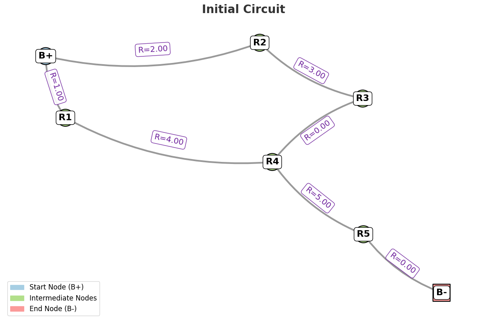
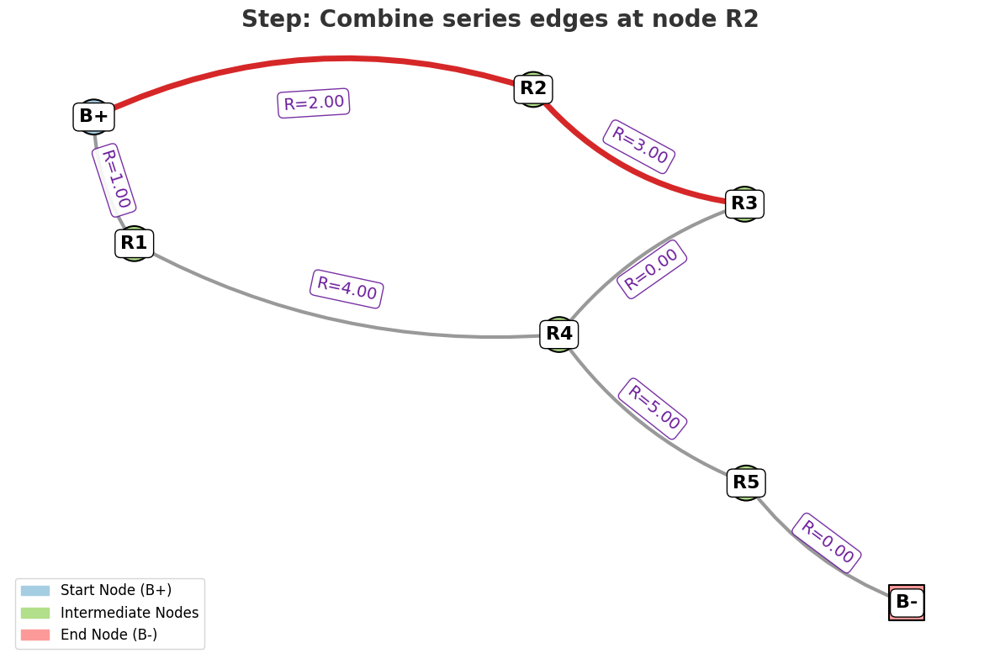
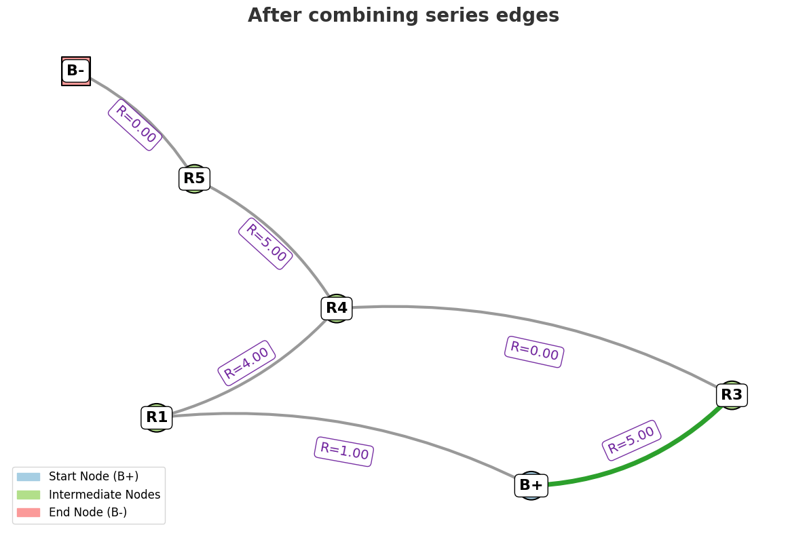
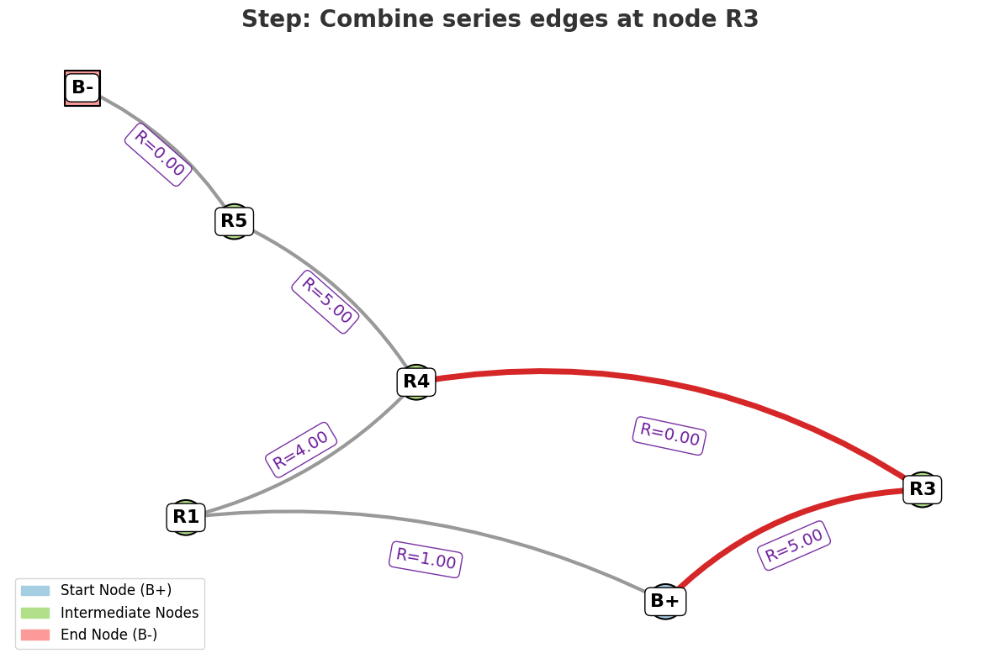
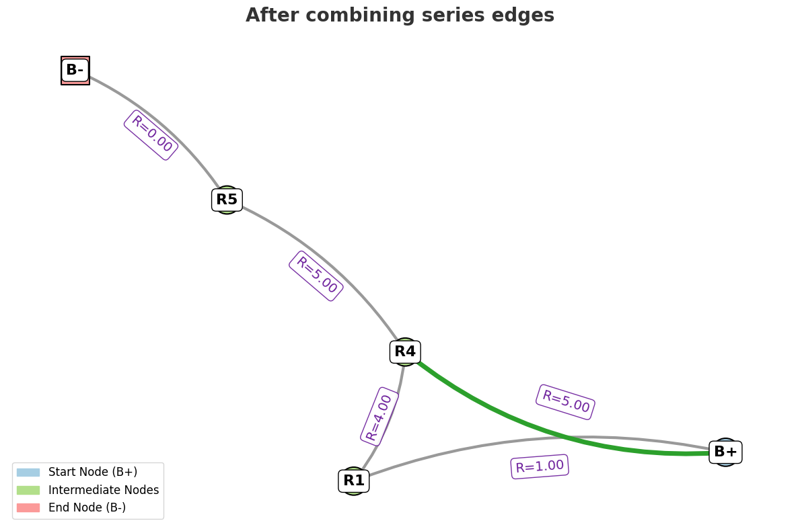
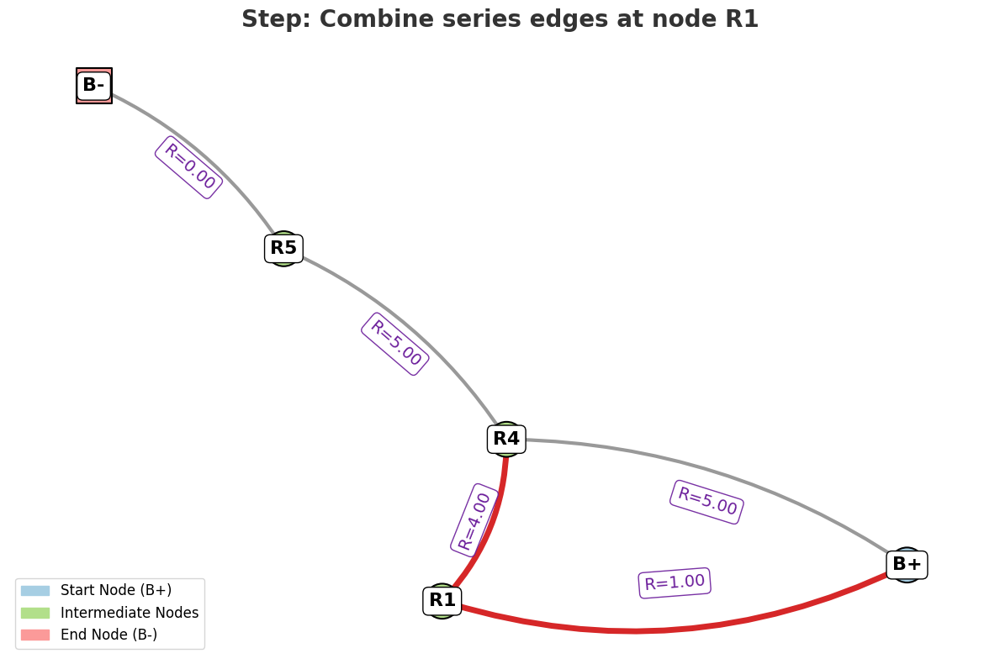
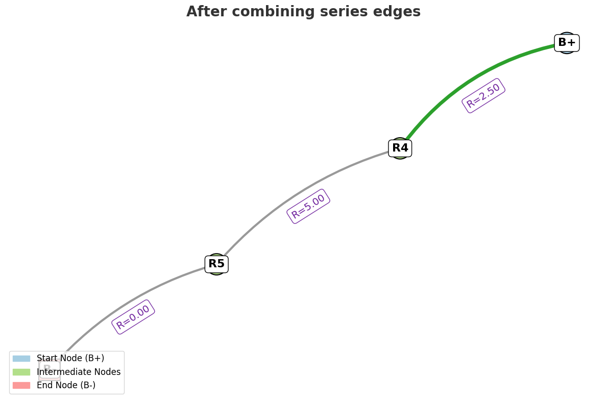
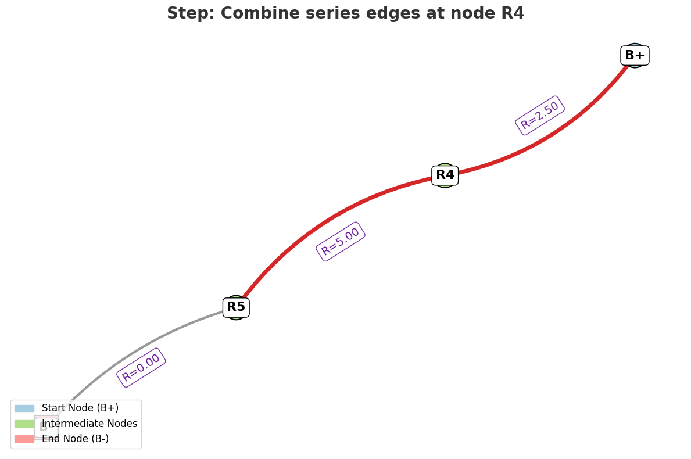
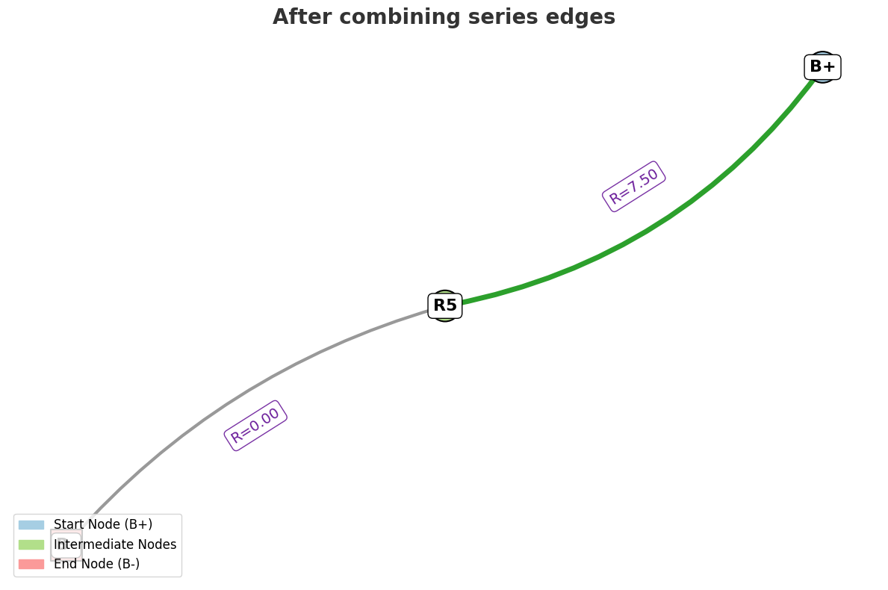
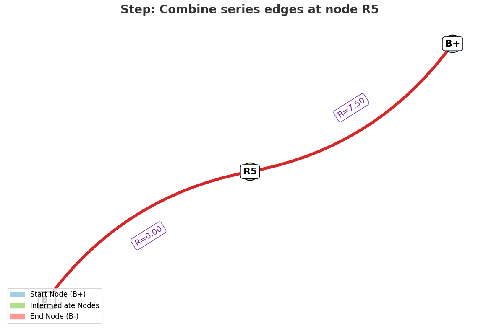
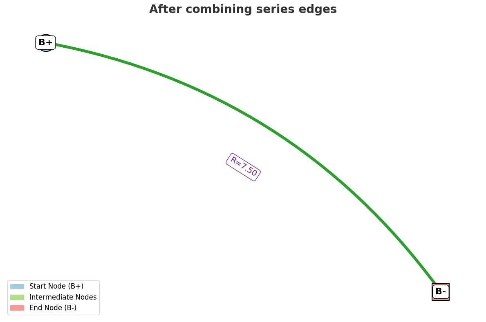
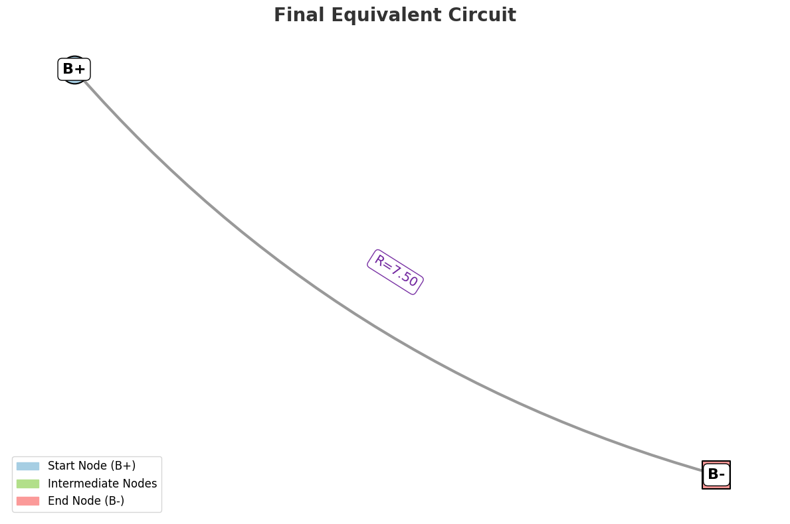


## 6. Graph Theory Algorithms for Optimization

In complex circuits with many resistors, an iterative approach might become inefficient, especially for large circuits with many nested configurations. Here are some techniques that could help:

- **Depth-First Search (DFS)**: This graph traversal technique can help explore all possible series and parallel combinations in the graph. It’s especially useful for exploring deep nested structures.
  
- **Breadth-First Search (BFS)**: This traversal method might be better for identifying the simplest series or parallel connections early in the circuit.

- **Network Libraries**: Libraries like **networkx** in Python can help automate graph manipulations and simplify the process, making it easier to work with larger circuits.

## Conclusion

The key to calculating equivalent resistance using graph theory is breaking down the circuit into smaller parts (series and parallel combinations) and simplifying it iteratively. By representing the circuit as a graph, we can apply graph algorithms to reduce complex configurations, eventually finding the equivalent resistance. This approach is extremely powerful for complex circuits and can be implemented efficiently using computational tools and algorithms.


