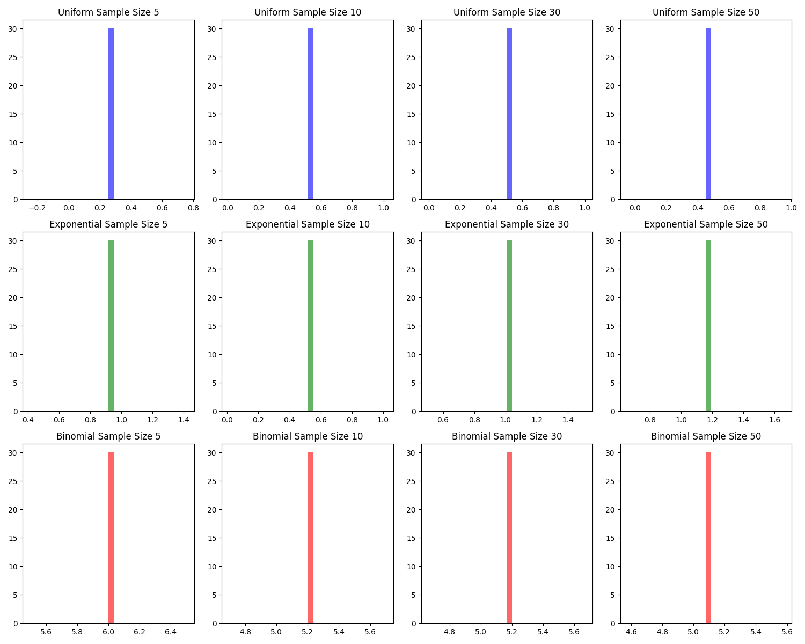

# Problem 1
# Exploring the Central Limit Theorem through Simulations

## 1. Introduction to the Central Limit Theorem (CLT)

The **Central Limit Theorem (CLT)** is a fundamental concept in probability and statistics. It states that regardless of the original distribution of a population, as the sample size increases, the sampling distribution of the sample mean will tend to approach a normal (Gaussian) distribution.

In simpler terms:
- **Population Distribution**: This can be any distribution (e.g., uniform, exponential, binomial).
- **Sample Mean**: The mean of a randomly selected sample from the population.
- **Sampling Distribution**: If you repeatedly take samples from the population, calculate their means, and plot them, you get a distribution of the sample means.
- **CLT in Action**: As the sample size increases, the sampling distribution of the sample mean becomes more normal, even if the population itself isn't normal.

## 2. Task Overview

The task involves simulating sampling distributions from different population distributions to observe the effects of the sample size on the convergence of the sampling distribution to normality. We will use three types of population distributions:
- **Uniform Distribution**: All values in a given range (e.g., 0 to 1) are equally likely.
- **Exponential Distribution**: Often used to model time between events in a process that occurs at a constant rate.
- **Binomial Distribution**: Represents the number of successes in a fixed number of trials, each with the same probability of success.

The task involves the following steps:

### 2.1 Simulating Sampling Distributions
- **Select Population Distributions**: We generate large datasets for each of the three distributions (uniform, exponential, and binomial).
- **Generate Datasets**: We will generate datasets for each distribution that represent the population.

### 2.2 Sampling and Visualization
- **Random Sampling**: We randomly sample data from the population and calculate the sample mean for different sample sizes (e.g., 5, 10, 30, 50).
- **Repeat the Process**: We will repeat the process multiple times (e.g., 1000 times) to create a sampling distribution of the sample mean.
- **Plot Histograms**: We will visualize the sampling distributions using histograms and observe how they converge to a normal distribution as the sample size increases.

### 2.3 Parameter Exploration
- **Effect of Population Distribution**: Investigate how the shape of the original population distribution influences the convergence of the sample mean's distribution.
- **Impact of Population Variance**: Explore how the variance of the population affects the spread of the sampling distribution.

### 2.4 Practical Applications of CLT
- **Estimating Population Parameters**: CLT allows for the estimation of population parameters with confidence, as the sample mean becomes a more reliable estimator as the sample size increases.
- **Quality Control in Manufacturing**: Even if the product quality distribution is not normal, the distribution of sample means from quality control tests will approach normality.
- **Financial Predictions**: CLT is used in financial models where the sample mean of returns is often normally distributed, making it easier to model and predict outcomes.

## 3. Python Code for Simulation

The following Python code simulates the sampling distributions for uniform, exponential, and binomial populations.

### 3.1 Import Libraries
```python
import numpy as np
import matplotlib.pyplot as plt
from matplotlib.animation import FuncAnimation

# For reproducibility
np.random.seed(42)

# Generate population data
population_size = 1000
uniform_population = np.random.uniform(low=0, high=1, size=population_size)
exponential_population = np.random.exponential(scale=1, size=population_size)
binomial_population = np.random.binomial(n=10, p=0.5, size=population_size)

# Function to calculate sample means
def sample_mean(population, sample_size, num_samples=1000):
    sample_means = []
    for _ in range(num_samples):
        sample = np.random.choice(population, size=sample_size, replace=False)
        sample_means.append(np.mean(sample))
    return sample_means

# Sample sizes to explore
sample_sizes = [5, 10, 30, 50]

# Create a figure and axis for the animation
fig, axes = plt.subplots(3, len(sample_sizes), figsize=(15, 12))

# Create a function for the animation
def update(i):
    # Uniform Distribution
    for j, sample_size in enumerate(sample_sizes):
        sample_means = sample_mean(uniform_population, sample_size)
        axes[0, j].cla()  # Clear the axis before plotting
        axes[0, j].hist(sample_means[:i], bins=30, density=True, alpha=0.6, color='b')
        axes[0, j].set_title(f"Uniform Sample Size {sample_size}")

    # Exponential Distribution
    for j, sample_size in enumerate(sample_sizes):
        sample_means = sample_mean(exponential_population, sample_size)
        axes[1, j].cla()  # Clear the axis before plotting
        axes[1, j].hist(sample_means[:i], bins=30, density=True, alpha=0.6, color='g')
        axes[1, j].set_title(f"Exponential Sample Size {sample_size}")

    # Binomial Distribution
    for j, sample_size in enumerate(sample_sizes):
        sample_means = sample_mean(binomial_population, sample_size)
        axes[2, j].cla()  # Clear the axis before plotting
        axes[2, j].hist(sample_means[:i], bins=30, density=True, alpha=0.6, color='r')
        axes[2, j].set_title(f"Binomial Sample Size {sample_size}")

    plt.tight_layout()

# Create an animation that updates over 30 frames
ani = FuncAnimation(fig, update, frames=range(1, 30), interval=150)

# Save the animation as a gif
output_path = 'clt_sampling_distribution.gif'
ani.save(output_path, writer='imagemagick', fps=2 )

print(f"Animation saved as {output_path}")

```

4. Discussion of Results
4.1 Observations
Uniform Distribution: As the sample size increases, the distribution of sample means becomes more normal.

Exponential Distribution: Even though the population is skewed, the sampling distribution of the sample mean approaches normality as the sample size grows.

Binomial Distribution: The sampling distribution also converges to normality, even if the population has discrete outcomes.

4.2 Impact of Population Variance
The variance of the population influences the spread of the sampling distribution. A larger variance in the population results in a wider spread of the sample means, even as the sample size increases.

5. Practical Implications of CLT
The Central Limit Theorem has practical applications in various fields:

Estimating Population Parameters: The CLT allows us to estimate unknown population parameters (such as the mean) accurately by taking sample means.

Quality Control: In manufacturing, the CLT helps to ensure that sample means follow a normal distribution, which is useful for monitoring product quality.

Financial Modeling: The CLT is used to predict the behavior of financial markets, where the mean returns can often be approximated as normally distributed.

6. Conclusion
Through simulations, we have observed how the Central Limit Theorem works in practice. By using different population distributions and varying the sample size, we saw that the sampling distribution of the sample mean tends to become more normal as the sample size increases, regardless of the original population distribution.

This result is crucial in statistics because it justifies many statistical methods that rely on the assumption of normality, such as hypothesis testing, confidence intervals, and regression analysis.