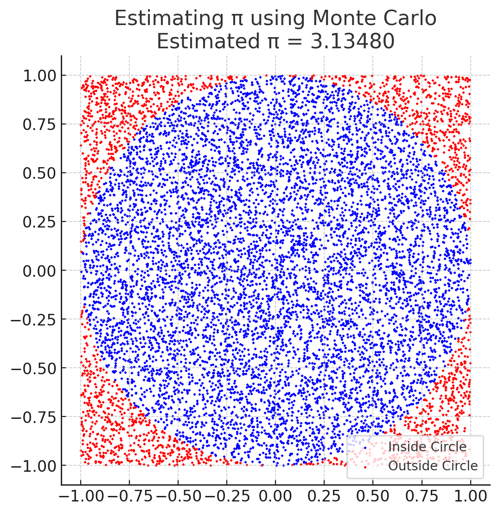
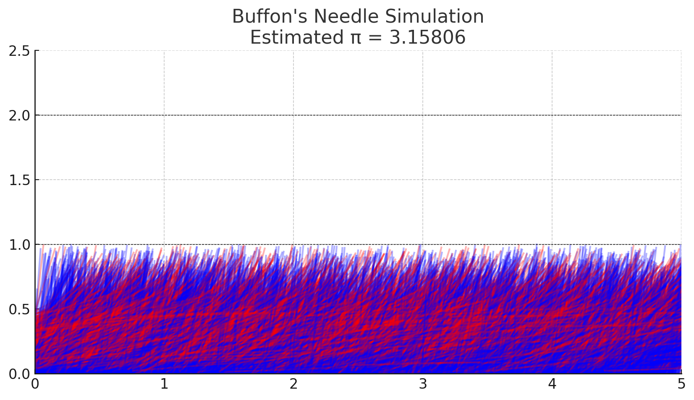

# Problem 2

#  Estimating π using Monte Carlo Methods

## Part 1: Estimating π Using a Circle (Geometric Probability)

###  Theoretical Foundation

This method estimates π by comparing areas. We use a **unit circle** (radius = 1) inside a square with side 2x2.

- **Circle Area** = π
- **Square Area** = 4

The probability that a random point falls inside the circle is:

```
P = Area of Circle / Area of Square = π / 4
```

Thus,

```
π ≈ 4 × (Points Inside Circle / Total Points)
```

###  Simulation Steps

1. Generate random (x, y) points in [-1, 1] × [-1, 1]
2. Count points where `x² + y² <= 1`
3. Estimate π using the ratio:
   ```
   π ≈ 4 × (# inside circle / total points)
   ```


###  Visualization

- **Blue** points are inside the circle
- **Red** points are outside

This forms a visual approximation of the circle.

###  Convergence

- Error decreases as more points are sampled
- Convergence rate is proportional to `1/√N` (N = number of points)

---

## Part 2: Estimating π Using Buffon’s Needle (Probabilistic Geometry)

###  Theoretical Foundation

Drop a needle of length `L` on a surface with lines spaced distance `D` apart. The probability that the needle crosses a line is:

```
P = (2L) / (πD)
```

Rearranging:

```
π ≈ (2L × # Throws) / (D × # Crossings)
```

###  Simulation Steps

1. Drop needles at random angles θ ∈ [0, π] and random vertical positions
2. Compute vertical projection:
   ```
   y_tip = (L / 2) × sin(θ)
   ```
3. A crossing occurs if this projection is greater than the distance to the nearest line
4. Use the above formula to estimate π



###  Visualization

- **Blue** needles cross a line
- **Red** needles do not
- Dotted black lines show the parallel lines

###  Convergence

- Slower than the circle method
- More variance due to trigonometric calculations

---

##  Comparison of Methods

| Feature                     | Circle-Based Monte Carlo        | Buffon’s Needle                     |
|----------------------------|----------------------------------|-------------------------------------|
| Core Concept               | Area ratio inside square         | Needle-line crossing probability    |
| Formula                    | `π ≈ 4 × (inside/total)`         | `π ≈ (2L × N) / (D × C)`            |
| Visual                     | Dots in a circle/square          | Needles and parallel lines          |
| Convergence Rate           | Faster                           | Slower                              |
| Complexity                 | Simple                           | Medium (involves sin, angle)        |

---

